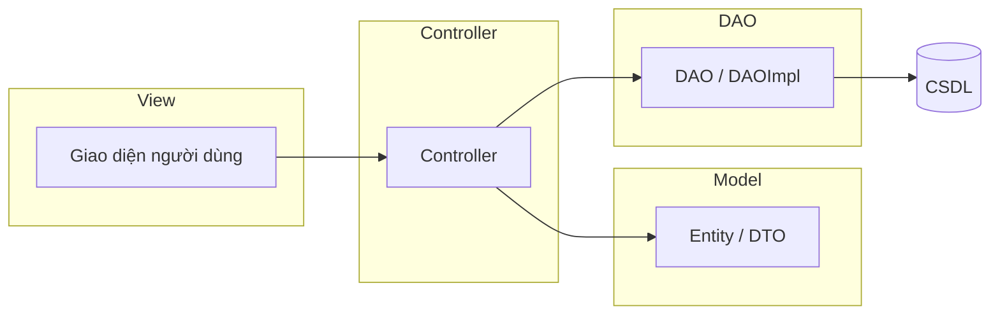

# Đề tài: Hệ thống quản lý phòng trọ

## 1. Tên đề tài (gợi ý)

**Xây dựng phần mềm quản lý phòng trọ trên máy tính (desktop) theo kiến trúc MVC kết hợp DAO**

## 2. Mục tiêu

- Số hóa quy trình: phòng, khách thuê, hợp đồng, chỉ số điện nước, hóa đơn và thanh toán.
- Giảm sai sót khi tính tiền và theo dõi công nợ.
- Phân quyền cơ bản (ví dụ: quản trị / chủ trọ / kế toán nếu nhóm mở rộng).

## 3. Phạm vi chức năng (MVP)

| Nhóm chức năng | Mô tả ngắn |
|----------------|------------|
| Danh mục | Tòa nhà/khu trọ, loại phòng, trạng thái phòng (trống / đang thuê / bảo trì). |
| Khách & hợp đồng | Hồ sơ khách, hợp đồng gắn phòng, ngày bắt đầu/kết thúc, tiền cọc. |
| Điện nước | Nhập chỉ số theo kỳ (tháng), tính tiêu thụ. |
| Hóa đơn & thanh toán | Tạo hóa đơn (tiền phòng + điện + nước + phụ phí), ghi nhận thanh toán, trạng thái. |
| Báo cáo đơn giản | Doanh thu theo tháng, phòng chưa thanh toán, danh sách khách đang thuê. |
| Hệ thống | Đăng nhập, (tuỳ chọn) nhật ký thao tác. |

Có thể cắt bớt báo cáo hoặc thông báo nếu thời gian không đủ; giữ **phòng – khách – hợp đồng – hóa đơn** là lõi.

## 4. Kiến trúc MVC + DAO



- **Model**: Lớp miền (entity) phản ánh bảng CSDL hoặc đối tượng nghiệp vụ; có thể thêm DTO cho màn hình.
- **View**: Chỉ hiển thị và nhận tương tác; không chứa truy vấn SQL.
- **Controller**: Điều phối luồng: nhận sự kiện từ View, kiểm tra đầu vào, gọi DAO (hoặc lớp Service mỏng nếu nhóm tách thêm tầng nghiệp vụ), cập nhật View.
- **DAO**: Một lớp (hoặc interface + lớp triển khai) cho mỗi nhóm bảng; toàn bộ JDBC / truy vấn nằm ở đây.

**Quy ước phụ thuộc:** `View → Controller → DAO → Database`. Model được dùng chung giữa Controller và DAO (truyền entity/DTO).

## 5. Gợi ý cấu trúc thư mục (Java + Maven)

```
src/main/java/com/quanlytro/
├── QuanLyPhongTroApp.java          # Điểm vào
├── model/                          # Entity (và DTO nếu cần)
├── view/                           # Form, panel, dialog (Swing / JavaFX)
├── controller/                     # Điều phối từng màn hình / module
├── dao/                            # Interface DAO
├── dao/impl/                       # JDBC DAO
└── util/                           # Kết nối DB, tiện ích (date, validate)

src/main/resources/
└── db/
    └── schema.sql                  # Script tạo bảng
```

## 6. Phân công nhóm 5 người (gợi ý)

| Thành viên | Trách nhiệm chính | Giao tiếp với |
|------------|-------------------|---------------|
| **1** | Thiết kế CSDL (`schema.sql`), lớp **Model** (entity), `util` kết nối DB, chuẩn hoá kiểu dữ liệu | 2, 3 |
| **2** | Toàn bộ **DAO** + `impl` (CRUD, truy vấn báo cáo), đảm bảo không rò rỉ SQL ra ngoài tầng | 1, 3 |
| **3** | **Controller** các module (phòng, hợp đồng, hóa đơn…), luồng nghiệp vụ, validate | 2, 4 |
| **4** | **View**: layout màn hình, bảng, form; chỉ gọi controller, không gọi DAO trực tiếp | 3 |
| **5** | Đăng nhập/phân quyền, tích hợp end-to-end, kiểm thử, slide báo cáo, chỉnh `README` / hướng dẫn cài đặt | Cả nhóm |

**Rủi ro cần tránh:** hai người cùng sửa một file lớn — nên chia theo **package** (vd. `view.hopdong`, `controller.hoadon`) và họp định kỳ merge.

## 7. Công nghệ đề xuất

- **Ngôn ngữ:** Java 17+  
- **Build:** Maven  
- **Giao diện:** Java Swing (nhẹ, phù hợp môn học) hoặc JavaFX  
- **CSDL:** MySQL / MariaDB (hoặc SQLite nếu muốn triển khai đơn giản)

## 8. Tiêu chí đánh giá gợi ý (nhóm trưởng trình bày với GV)

- Đúng phân tầng MVC + DAO, có sơ đồ.
- CSDL chuẩn hoá cơ bản (khóa ngoại, ràng buộc).
- Ứng dụng chạy được, luồng chính không lỗi.
- Báo cáo + phân công rõ trong tài liệu.

---

*Tài liệu này mô tả đề tài và phân chia; mã nguồn khung nằm trong thư mục `src/` của dự án.*
